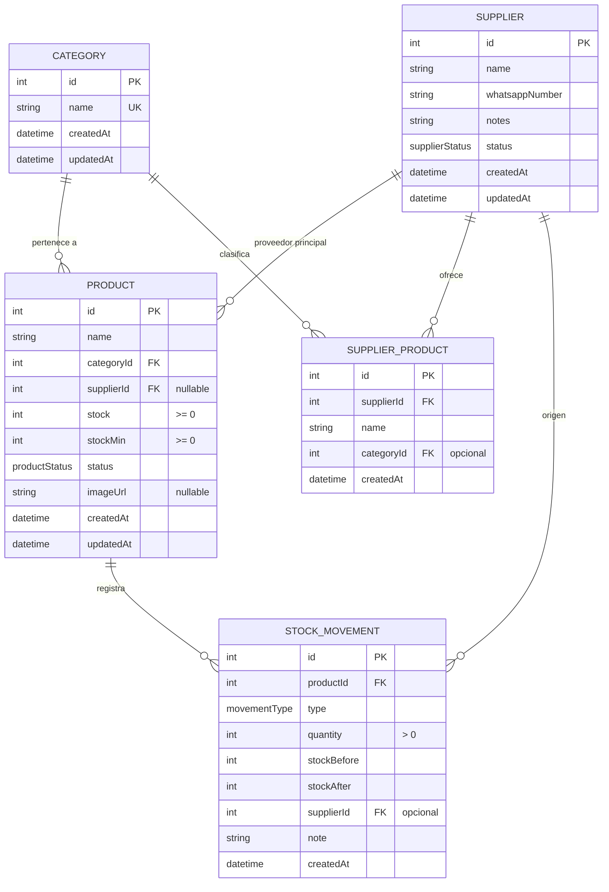

# Base de Datos — Sistema de Gestión de Stock para Pet Shop

## 1. Motor

**PostgreSQL** gestionado por **Supabase** (free tier). ORM / acceso: **Prisma**.

## 2. Entidades y relaciones

### Catálogo de tablas

| Tabla | Descripción |
|---|---|
| `Category` | Categorías de productos. |
| `Supplier` | Proveedores con número de WhatsApp. |
| `Product` | Productos de la tienda. |
| `SupplierProduct` | Productos que ofrece cada proveedor (independiente de `Product`). |
| `StockMovement` | Historial inmutable de cada modificación de stock. |

## 3. Decisiones importantes

### 3.1 `SupplierProduct` es independiente de `Product`

No existe FK de `SupplierProduct → Product`. Los listados de proveedores y los
productos de la tienda son entidades conceptualmente distintas, aunque compartan
nombre. Eliminar un producto del listado de un proveedor NO afecta al producto
de la tienda.

### 3.2 Proveedor principal de `Product`

`Product.supplierId` (`nullable`) representa el **proveedor principal editable**.
En el futuro, cuando se permitan múltiples proveedores por producto, se
introducirá una tabla junction `ProductSupplier`. Hoy no se crea para evitar
complejidad innecesaria (punto de extensión documentado).

### 3.3 Historial inmutable

`StockMovement.productId` no usa `ON DELETE CASCADE`: aunque un producto se
marque `INACTIVE`, su historial permanece. Los productos no se borran
físicamente (papelera vía estado `INACTIVE`).

### 3.4 Enums

Definidos a nivel de Prisma; se materializan como `TEXT` con
`CHECK (col IN (...))` en PostgreSQL vía migración SQL manual cuando Prisma no
lo soporte en schema.

- `ProductStatus`: `ACTIVE | INACTIVE`
- `SupplierStatus`: `ACTIVE | INACTIVE`
- `MovementType`: `BUY | SALE | BREAKAGE | EXPIRY | DONATION | INTERNAL_CONSUMPTION | MANUAL_ADJUST`

## 4. Restricciones de integridad

Prisma no expresa `CHECK` constraints en schema; se añaden mediante **migración
SQL**:

- `Product.stock >= 0`  → impide stock negativo a nivel base de datos.
- `Product.stockMin >= 0`
- `StockMovement.quantity > 0`
- Nombres `NOT NULL` y normalizados (sin espacios redundantes).
- `Supplier.whatsappNumber NOT NULL`, formato normalizado `+<código><número>`.
- Foreign keys con las cardinalidades anteriores.

Las reglas se aplican también en backend (Zod) y en negocio ("distribución
lógica"), con la DB como **última barrera** (defensa en profundidad).

## 5. Índices

- `StockMovement.productId` → consultas de historial por producto.
- `StockMovement.createdAt` → movimientos del mes.
- `Product.categoryId` → listado/filtros por categoría.
- `Product.supplierId` → relación proveedor principal.
- `Product.status` → dashboard / papelera.
- `SupplierProduct.supplierId` → listado por proveedor.
- `Category.name` (único).

## 6. Timestamps

- `createdAt` / `updatedAt` con `@default(now())` y actualización en `updatedAt`.
- `StockMovement` solo `createdAt` (historial inmutable).

## 7. Seed inicial

`prisma/seed.ts`: creado en fases posteriores (categorías y proveedores de
ejemplo). No se siembran datos en la Fase 1.